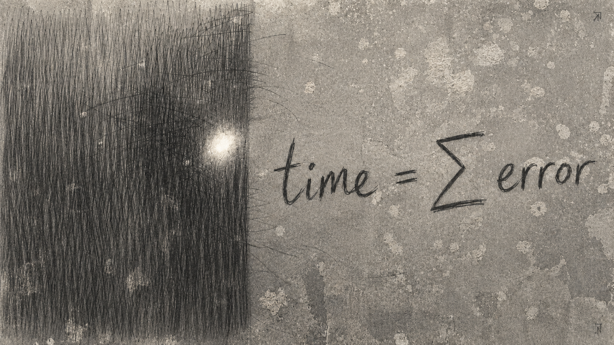

# Эпилог Архива

---

## **Время**  
## **измеряется**  
## **в ошибках**

**time = Σ error**

*Фрагмент восстановлен из поздних слоёв Архива.  
Источник не установлен.  
Авторство приписывается Техножрецам, но чтение оспаривается Вероятностниками.  
Антикод считает текст повреждённым.  
Биокод считает повреждение частью текста.*

---
